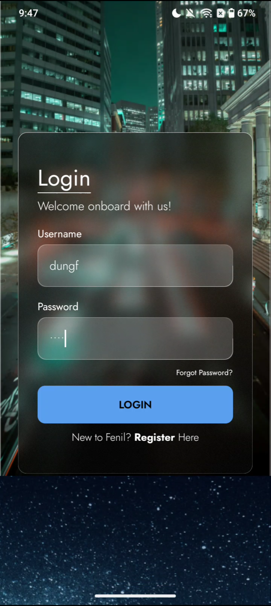

# Glassmorphism Login Screen with Jetpack Compose 🌟

This project demonstrates a **Login Screen with Glassmorphism Effect** designed using **Jetpack Compose** in **Kotlin**. The app features a stunning frosted glass design with a continuous scrolling image background that highlights the glassmorphism effect, offering a sleek and modern UI.

---

## 🚀 Features

- **Glassmorphism Effect**: A beautiful frosted-glass UI design for the login form.
- **Continuous Scrolling Background**: Dynamic and smooth scrolling background images.
- **Interactive UI Elements**: Includes Login, Register, and Forgot Password options.
- **Responsive Design**: Adapts seamlessly to various screen sizes.
- **Built with Jetpack Compose**: A modern declarative UI framework for Android development.

---

## 🖼️ Demo

### Login Screens
Below are snapshots of the Glassmorphism Login Screen with scrolling background images:

| Screenshot 1 | Screenshot 2 | Screenshot 3 |
|---|---|---|
||||

---

## 🛠️ Installation & Setup

1. Clone the repository to your local machine:
   ```bash
   git clone https://github.com/fenil-vavaiya/Login-Compose.git

2. Open the project in Android Studio.
 
3. Build and run the app on an Android emulator or a physical device.
---

## 🙌 Acknowledgements

Jetpack Compose for providing a modern UI framework.
Tutorials and resources from the Android developer community.

## 🔗 Connect with Me

GitHub: [fenil-vavaiya](https://github.com/fenil-vavaiya "Fenil Vavaiya")

LinkedIn: [Fenil Vavaiya](https://www.linkedin.com/in/fenil-vavaiya-225696259/ "Fenil Vavaiya")

